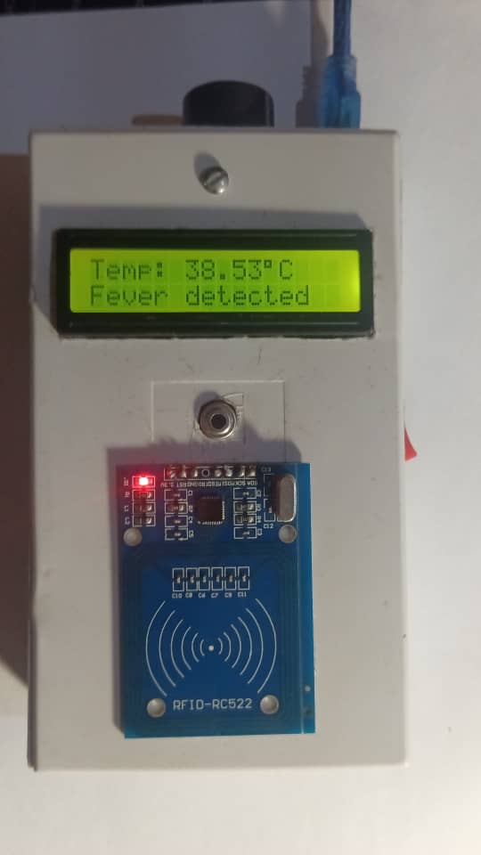

# Welcome to Tutela

Real-time health monitoring system for pig farms with hierarchical data tracking and historical lookup capabilities

## [Watch Demo Video](https://vimeo.com/1040586569)

## 

## Hedera Consensus Service

### Topic Structure & Message Schema

### Level 1: Region Topic

| Field       | Type     | Description                   |
| ----------- | -------- | ----------------------------- |
| farmTopicId | string   | Hedera Topic ID for the farm  |
| ethAddress  | string   | Farm owner's Ethereum address |
| farmerName  | string   | Name of the farmer            |
| timestamp   | ISO date | Registration timestamp        |

### Level 2: Farm Topic

| Field      | Type     | Description                 |
| ---------- | -------- | --------------------------- |
| pigTopicId | string   | Hedera Topic ID for the pig |
| rfid       | string   | Pig's RFID identifier       |
| timestamp  | ISO date | Registration timestamp      |

### Level 3: Pig Topic

| Field       | Type     | Description           |
| ----------- | -------- | --------------------- |
| hasFever    | boolean  | Fever status flag     |
| temperature | number   | Temperature reading   |
| timestamp   | ISO date | Measurement timestamp |

## Tools & Integrations

- [Uses Hedera Testnet for consensus]()
- Cloud Functions for API endpoints
- Topic IDs are used as foreign keys
- Messages are JSON formatted
- CORS enabled for web access
- OpenAI LLM and Langchain Integration

## API Endpoints

### Topic Creation

| Endpoint        | Method | Purpose                                |
| --------------- | ------ | -------------------------------------- |
| `/createRegion` | POST   | Creates new region topic               |
| `/registerFarm` | POST   | Creates farm topic and links to region |
| `/registerPig`  | POST   | Creates pig topic and links to farm    |

### Data Query

| Endpoint                | Method | Purpose                            |
| ----------------------- | ------ | ---------------------------------- |
| `/getFarmId`            | GET    | Retrieves farm details from region |
| `/getTopicMessages`     | GET    | Gets all messages for any topic    |
| `/submitPigFeverStatus` | GET    | Records pig health status          |

### Example IoT device call:

```typescript
GET /submitPigFeverStatus?rfid=123&hasFever=true
```

## Team & Contributors

- [Acgodson]()
- [Morakinyo]()
- [Evaristus]()


© Dec 18th 2024